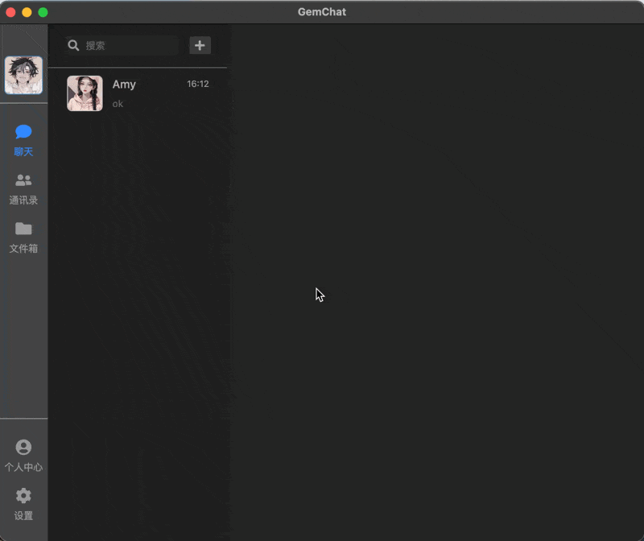
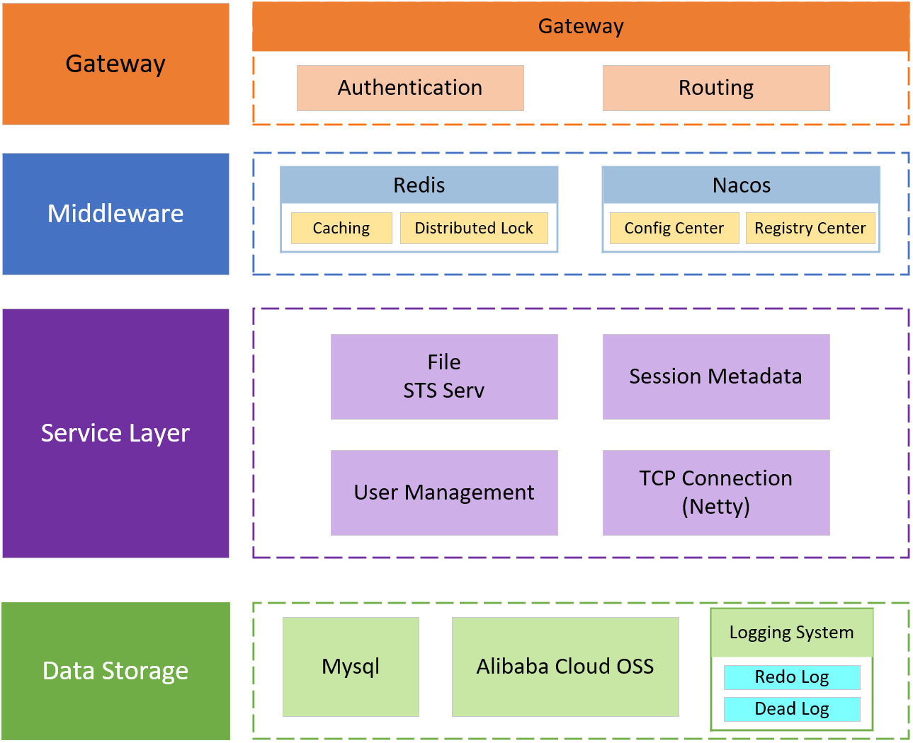

<div align="center">
  
</div>

# <center># GemChat-server</center>

A microservice-based chat communication software server that uses Netty to implement a minimalist custom remote communication solution. It features a reliable message mechanism and supports user offline message synchronization, cloud file upload, and other functions.

---

# Feature Overview
1. Utilize a lightweight custom message protocol as the underlying message transmission layer.
2. Implement reliable message transmission.
3. Achieve high concurrency and high availability.
4. Have a supporting client: [GemChat-client](https://github.com/GEM26-Jay/GemChat-client "GemChat-client").
   


---

## Main Tech Stack
- Java
- SpringBoot
- SpringCloud
- Netty
- database
    - Mysql
    - Redis

#

## Project Structure


## Performance Testing && Stress Testing
In a LAN WIFI environment, two personal computers are used for testing: one is configured as a server with 32GB memory and 20-core processor, and the other simulates 100 clients sending one-to-one chat messages randomly.

| mode | QPS  | duration | result |
|------|------|------|-------|
| 0    | 1.0W | 100s     | no message accumulation |
| 0    | 1.5W | 100s     | minor message accumulation| 
| 1    | 1.0W | 100s     | no message accumulation |
| 1    | 1.5W | 100s     | minor message accumulation| 
| 2    | 2.0K | 100s     | no message accumulation |

- **mode2 (using memory-mapped files with immediate flushing to disk)** saw a significant drop in QPS because its write operations are synchronously flushed to the SSD, limiting performance to the SSD's write speed.
- **mode0 (no persistence)** and **mode1 (using memory-mapped files with OS-controlled asynchronous flushing)** achieved substantially higher QPS. Although network I/O proved to be a major constraint in the personal experimental environment, it's clear that this architecture can deliver a performance of at least 10,000 QPS.
```properties
# config the saveStrategy at "application.properties"
message.async-save.saveStrategy = 1 # default
```

---

## Project Setup && Deployment
1. prepare and config the datasource.
```bash
mysql -u `your username` -p < init.sql
```
2. prepare and config the redis
3. prepare and config the nacos. 
4. config the gateway.

### Configuration example
#### 1.nacos configuration
```yaml
# bootstrap.yml
spring:
  application:
    name: your application name

  cloud:
    nacos:
      server-addr: your nacos address

      config:
        namespace: your namespace
        group: your group
        file-extension: yaml

      # 服务发现设置
      discovery:
        namespace: your namespace
        group: your group
```
#### 2.datasource and other configuration
```yaml
# application.yml
spring:
  datasource:
    url: your database url
    username: example
    password: example
    driver-class-name: com.mysql.cj.jdbc.Driver
    type: com.alibaba.druid.pool.DruidDataSource
  data:
    redis:
      host: your redis host 
      port: your redis port
      password: your password if needed
      database: 0           
      timeout: 3000ms   

mybatis-plus:
  mapper-locations: classpath:mapper/*.xml

# config-jwt
jwt:
  secretKey: your jwt-secretKey
  ttlMillis: your secretKey-ttlMillis

# config-aliyun-oss if needed service-file
aliyun:
  oss:
    endpoint: your endpoint
    access-key-id: your access-key-id
    access-key-secret: your access-key-secret
    region: your region
    role-arn: your role-arn
    bucket-name: your bucket-name

```

#### 3.gateway configuration
```yaml
# gateway configuration
spring:
  cloud:
    gateway:
      routes:
        - id: user-service
          uri: lb://service-user
          predicates:
            - Path=/api/user/**,/api/friend/**

        - id: file-service
          uri: lb://service-file
          predicates:
            - Path=/api/file/**

        - id: chat-service
          uri: lb://service-chat
          predicates:
            - Path=/api/group/**,/api/chat/**

        - id: netty-service
          uri: lb://service-netty
          predicates:
            - Path=/api/netty/**

# config-jwt Authentication is handled by the gateway, so JWT must be configured.
jwt:
  secretKey: your jwt-secretKey
  ttlMillis: your secretKey-ttlMillis
```

